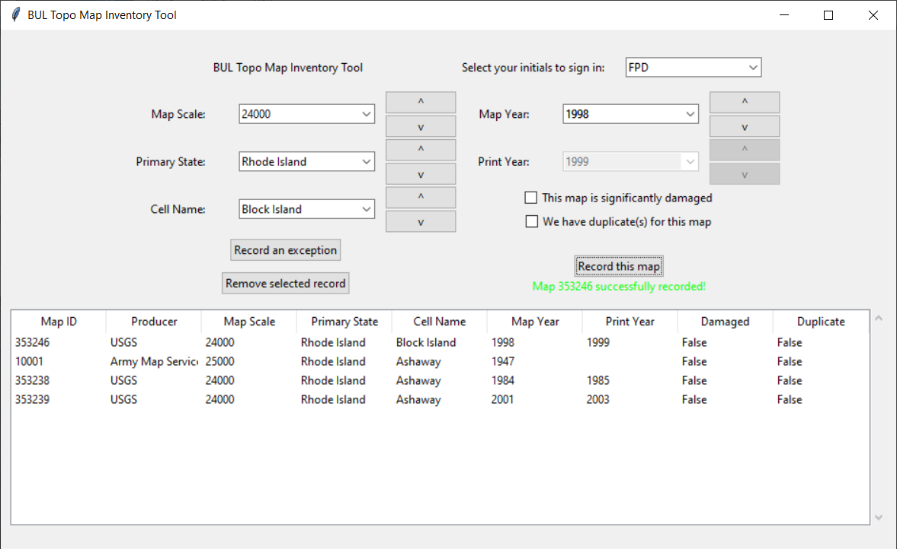

# Welcome to the BUL Topo Map Inventory Tool

This is a Python tool that we built to inventory topographic maps in Brown University's map collection in the Sciences Library. Instead of having people manually record the attributes of each map, we created a graphical user interface with tkinter which allows people to select the key attributes of each map using drop-down menus and buttons. The options available in each drop-down menu are populated with data from the USGS Historical Topographic Map Collection (HTMC), and the menus are dynamically updated based on user selections, allowing users to match each physical map to its corresponding digital record with as little hassle as possible. Checkboxes allow users to flag maps that are damaged or for which we have duplicates, and there is a workflow for recording "exception" maps, or topographic maps that are filed in our collection but aren't part of the HTMC, even if they use some of the same attribute schema. Behind the scenes, information about each map that we record using the tool is stored in a SQLite database.

Program written by Ethan McIntosh, Brown University '22, for GeoData@SciLi

See usgs_inventory_workflow.pdf for instructions on the process of running the tool.

### Requirements for running the tool

- You need to be granted access to the Brown University Library shared drive, where the SQLite map database is stored (for users outside of Brown who are applying this to your own workflow, set up a similar folder structure)
- Your computer needs to have Python 3 or higher installed.
- You need to install the pandas module into your Python interpreter, if you don't have it already. All other modules needed for the tool are in the Python Standard Library.

### How to run the tool

1. Clone this repository somewhere on your computer.
2. Open a terminal with the geodata_map_inventory folder as the working directory.
3. Run either ```python bul_topo_tool.py``` or ```python3 bul_topo_tool.py```, depending on how your Python is set up.
4. The tool should open in its own window. To stop the program, just close the window.

Note: the program will not be able to record maps if anyone is actively writing changes to the map database file using a application like DB Browser. Python will throw an error saying the database is locked. We can have the database open in DB Browser while the script is running, but only in reading mode. If we need to make manual changes to the database using DB Browser, be sure to hit "Write Changes" (Ctrl-S) to get out of writing mode before running the script again. 



### File Descriptions

| file name             | description                                                                                                                                                                                                                                                                         |
| --------------------- | ----------------------------------------------------------------------------------------------------------------------------------------------------------------------------------------------------------------------------------------------------------------------------------- |
| bul_topo_tool.py      | This is the only .py file that's meant to be run directly. Everything else is "supporting material". Any code having to do with the graphics and layout of the tool is here, and so is most of the logic governing what different buttons do and how they interact with each other. |
| file_io.py            | These methods are for getting data in and out (io) of the csv files in this repository.                                                                                                                                                                                             |
| db.py                 | These methods are for using SQL commands to interact with the .db file on the library shared drive where our topo map inventory data gets stored.                                                                                                                                   |
| usgs_topos.csv        | A table with information about every map in the USGS's [Historical Topographic Map Collection](https://www.usgs.gov/programs/national-geospatial-program/historical-topographic-maps-preserving-past) (HTMC).                                                                       |
| users.csv             | A list of authorized users of the BUL Topo Map Inventory Tool (initials only).                                                                                                                                                                                                      |
| next_exception_id.csv | Stores a 5-digit number that will be assigned as the unique identifier of the next "exception map" we find (any map that's physically in our collection but isn't part of the HTMC. Each time we record an exception map, this number gets updated.)                                |

### How the code for the main script is organized

The main executable script file (bul_topo_tool.py) is organized into sections, starting with a section holding the code for two custom data structures: an AutocompleteCombobox (a drop-down menu that autocompletes typed-in entries) and a LabeledDropDownMenu, which bundles together a drop-down menu with other tkinter widgets and links these bundled objects to each other in a hierarchical order. Below the section for the custom classes are sections for tool initialization, recording regular maps, recording exception maps, removing records, and miscellaneous operations. All of these sections of code consist solely of methods. The code that actually builds the main tool window and runs the application is at the bottom of the file (roughly 600 lines in), after the methods.

Note - in Oct 2022 we discovered a bug where the values for the series and sheet for exception maps are inverted and stored in the opposite columns in the database table. Since we have already begun our inventory process, we have opted not to correct this issue.